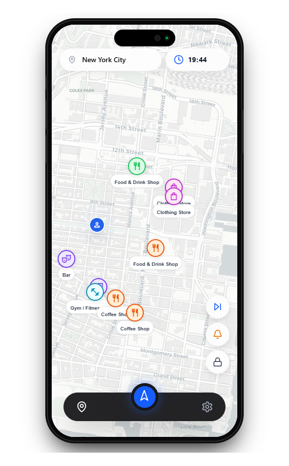
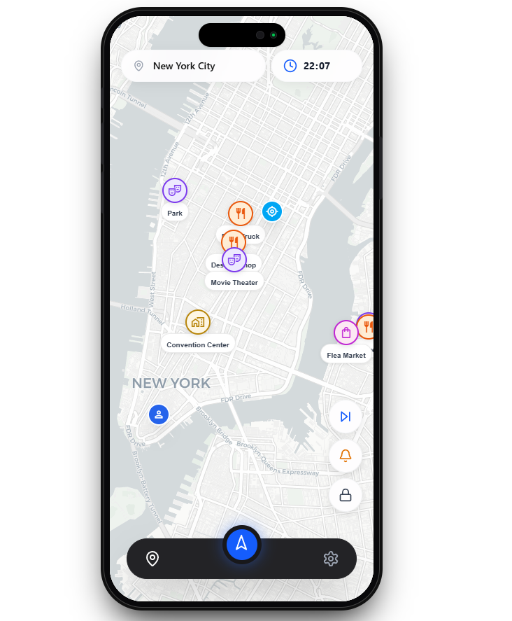
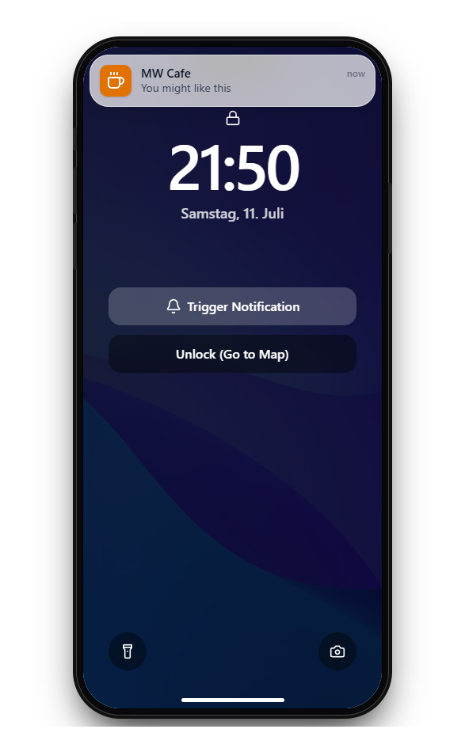
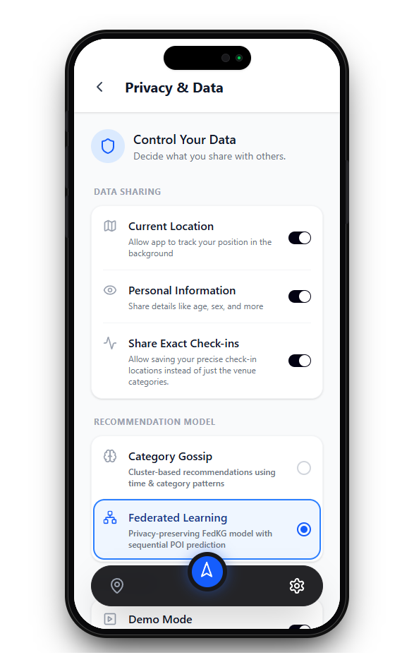
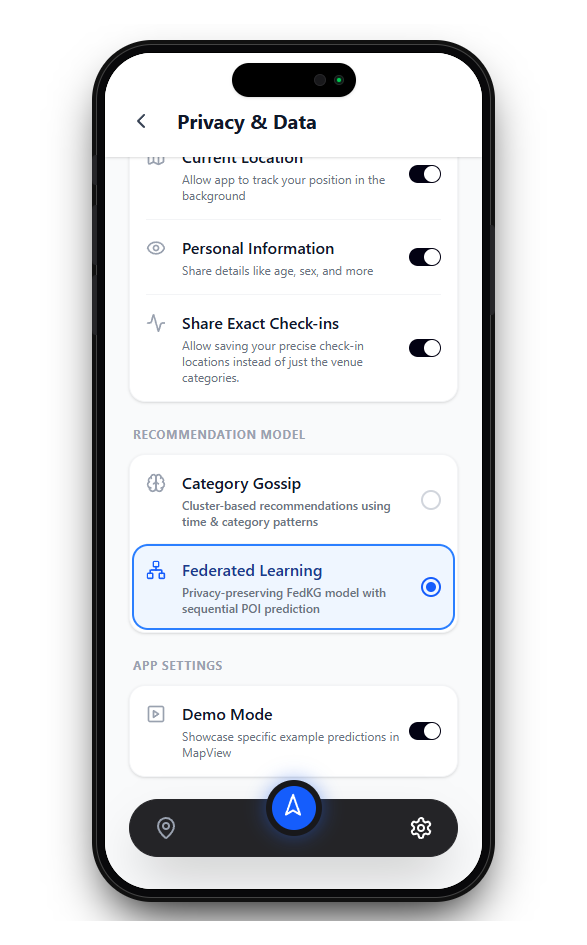

# Decentralized Recommender Systems Prototype

Welcome to the **Decentralized Point-of-Interest Recommender System** project! This repository contains a prototype demonstrating an approach to tourist recommender systems using decentralized architectures.

## Table of Contents
- [Overview](#-overview)
- [Screenshots & Features](#-screenshots--features)
- [Getting Started](#-getting-started)
  - [Running the Backend](#running-the-backend)
  - [Running the Frontend](#running-the-frontend)

## Overview
Because location data is very sensitive, we want to protect your privacy! That's why we built a recommender system which proposes personalized recommendations for interesting places in your vicinity, without sharing your data. The only thing you share are noisy gradients. No chance for data broker selling your data to insurance companies or political parties.

## Screenshots & Features

Here is a glimpse of the application in action.

### Video Demonstration

https://github.com/user-attachments/assets/3395c0fa-4320-4fa4-a0cb-3decc43863aa

### 1. Category Gossip Recommendation
Here you can see the recommendations the category gossip model would give for a sample user. We built his user features based on his checkins, leaving the last checkin out. Also we trained the category recommender with his data but the last checkin. Then, based on the last checkin location and time, we predicted his user cluster and recommended 5 categories and 2 places per category in his vicinity. 

### 2. Federated Knowledge Graph (FedKG) Recommendation
Here you can see the recommendations the FedKG model would give for a sample user. We built his trajectory of up to 100 places he visited before, leaving the last checkin out. Based on the 2nd-last checkin simulating his current position, we rank all known point of interests in New York City and recommend the 10 highest ranked places to the user.

### 3. Lock Screen
Here you can see how a notification from running in the background would look like. If the user allowed the app to run even when it's not active, we can regularaly scan for an interesting places in the vicinity while the user walks through a city. When the user is near a place with a very high predicted ranking, we can notify him on the lock screen. 

### 4. Settings
Here you can see the settings page. The top 3 toggles are fake and do not have an actual influence on the behavior of the prototype. Nevertheless, when the protoype would be deployed, they would be the only three settings the user would see and based on his preferences, the training as well as the model which is used for prediction is different. When the user tries to disable one of the settings, they will get a warning of decreasing performance on their personal recommendations, decreased training performance for the system or a switch to a weaker model.  

### 5. Demo Mode
At the very bottom of the screen you can see the toggle for the demo mode. With it enabled, we will loop only over 3 specific hardcoded users and their recommendations. When it's disabled, you can skip though every user which exists in our training set. 

## Getting Started

To run this project locally, you will need to start both the backend API and the frontend application.

### Running the Backend

First, start the backend API. Detailed instructions can be found in the [Backend README](./backend/README.md).

### Running the Frontend

Once the backend is running, start the frontend application. Detailed instructions can be found in the [Frontend README](./frontend/README.md).

## Interacting with the Prototype

After starting both services, the application will be accessible in your browser at:
**[http://localhost:5173](http://localhost:5173)**
We recommend Google Chrome for optimal behavior.
